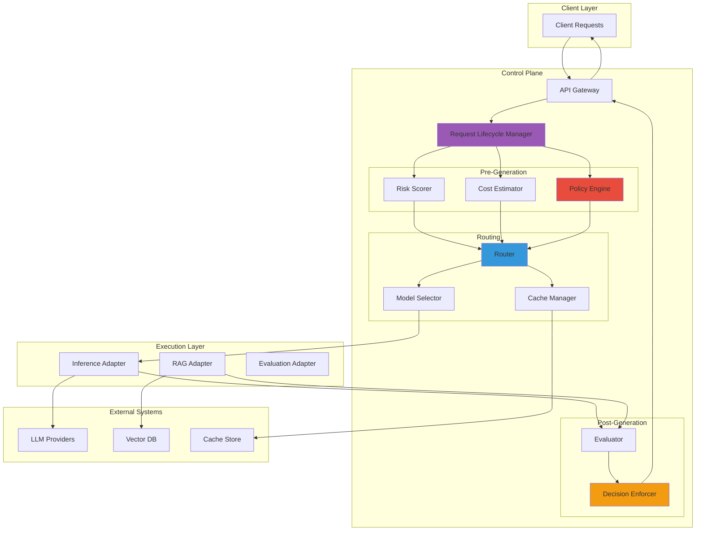
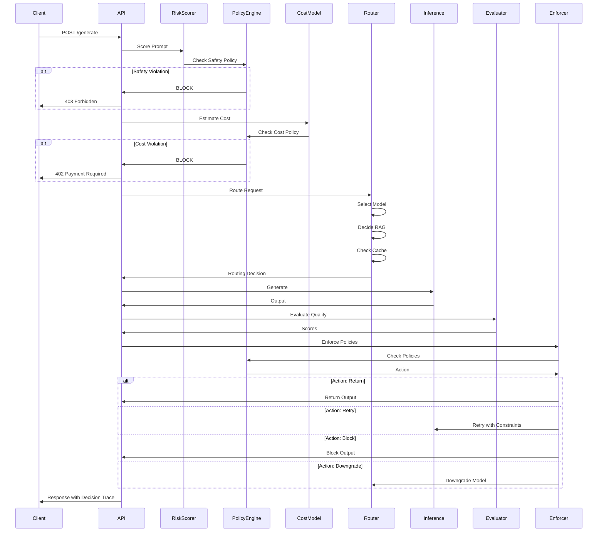

<div align="center">

# 🎛️ LLM Control Plane

<div>

[](https://www.python.org/)
[]()
[]()
[]()

</div>

**Runtime governance layer for LLM systems with real-time policy enforcement, cost-aware routing, and safety guarantees**

*Platform-level infrastructure for production LLM deployments*

---

[Architecture](#-architecture) • [Request Lifecycle](#-request-lifecycle) • [Policy Engine](#-policy-engine) • [Quick Start](#-quick-start) • [API](#-api)

</div>

---

## 🌟 Overview

The **LLM Control Plane** is a production-grade runtime governance layer that sits in front of LLM systems, making real-time decisions about request handling, model selection, cost management, and safety enforcement. This is **platform infrastructure**, not a demo or SDK.

### What This System Governs

<div align="center">

| Governance Domain | Capabilities |
|:-----------------:|:------------|
| **Request Lifecycle** | Pre-generation → Routing → Post-generation enforcement |
| **Policy Engine** | Declarative YAML policies enforced at runtime |
| **Cost Management** | Token-level estimation, budget ceilings, auto-downgrade |
| **Safety & Reliability** | Risk scoring, hard rejection, fail-safe behavior |
| **Quality Assurance** | Hallucination detection, grounding validation |
| **Routing Intelligence** | Model selection, RAG decision, cache strategy |

</div>

### Why This Matters

This control plane **outclasses** standalone systems by providing:

- ✅ **Unified Governance**: Single point of control for all LLM operations
- ✅ **Real-time Decisions**: Sub-100ms policy enforcement
- ✅ **Cost Optimization**: Automatic model downgrades and cache-first routing
- ✅ **Safety Guarantees**: Hard rejection for policy violations
- ✅ **Production Reliability**: Fail-safe behavior under overload

---

## 🏗️ Architecture

### System Architecture



### Request Lifecycle



---

## 🔄 Request Lifecycle

### Phase 1: Pre-Generation Checks

**Risk Scoring**
- Prompt injection detection
- Safety classification
- Ambiguity detection
- Risk score calculation (0-1)

**Policy Validation**
- Safety policy check (hard rejection if violated)
- Cost policy check (block if exceeds threshold)
- Latency budget validation

**Cost Estimation**
- Token-level cost calculation
- Per-model pricing lookup
- Budget ceiling check

### Phase 2: Routing Decision

**Model Selection**
- Default model assignment
- Cost-aware downgrade
- Performance-based selection

**RAG Decision**
- Query complexity analysis
- Context requirement assessment
- Retrieval threshold check

**Cache Strategy**
- Cache-first routing
- Cache key generation
- TTL validation

### Phase 3: Post-Generation Enforcement

**Quality Evaluation**
- Hallucination detection
- Grounding validation
- Confidence scoring

**Policy Enforcement**
- Quality policy check
- Cost policy validation
- Latency policy check

**Action Execution**
- `return`: Return output as-is
- `retry`: Retry with stricter constraints
- `downgrade`: Use cheaper model
- `block`: Block output
- `redact`: Remove problematic content

---

## ⚙️ Policy Engine

### Declarative Policies

Policies are defined in YAML and enforced at runtime:

```yaml
policies:
  cost:
    max_cost_per_request: 0.10
    budget_ceiling: 1000.00
    auto_downgrade_threshold: 0.05
    
  safety:
    hard_rejection_enabled: true
    risk_threshold: 0.8
    
  quality:
    min_grounding_score: 0.6
    max_hallucination_probability: 0.7
    
  enforcement:
    conditions:
      cost_exceeded: "block"
      safety_violation: "block"
      quality_below_threshold: "retry"
```

### Policy Checks

| Policy Type | Check | Action on Violation |
|------------|-------|---------------------|
| **Cost** | Estimated cost > threshold | Block or downgrade |
| **Safety** | Risk score > threshold | Hard rejection |
| **Quality** | Hallucination > threshold | Retry or block |
| **Latency** | Latency > SLO | Downgrade model |

---

## 💰 Cost-Aware Routing

### Cost Model

- **Token-level estimation**: Precise cost calculation per request
- **Per-model pricing**: Supports multiple LLM providers
- **Budget tracking**: Real-time budget monitoring
- **Auto-downgrade**: Automatic model selection based on cost

### Cost Optimization Strategies

1. **Cache-first**: Check cache before expensive inference
2. **Model downgrade**: Use cheaper models when cost threshold approached
3. **Batch optimization**: Group requests for efficiency
4. **Budget alerts**: Warn when approaching budget ceiling

### Example Cost Decision

```
Request Cost Estimate: $0.12
Policy Threshold: $0.10
Action: Auto-downgrade to gpt-3.5-turbo
New Cost: $0.003
Result: Request allowed with downgrade
```

---

## 🛡️ Safety & Reliability

### Safety Classification

**Pre-Generation Checks:**
- Prompt injection detection (pattern matching)
- Safety keyword scanning
- Risk score calculation
- Hard rejection for high-risk prompts

**Post-Generation Checks:**
- Content moderation
- Quality validation
- Policy compliance

### Reliability Features

- **Fail-safe behavior**: Graceful degradation under overload
- **Explicit rejections**: Clear reasons for blocked requests
- **Retry logic**: Automatic retries with stricter constraints
- **Circuit breakers**: Protection against cascading failures

---

## 🚀 Quick Start

### Prerequisites

- Python 3.10+
- API keys for LLM providers
- Optional: Vector DB for RAG

### Installation

```bash
# Clone repository
git clone https://github.com/Amankhan2370/llm-control-plane.git
cd llm-control-plane

# Create virtual environment
python -m venv venv
source venv/bin/activate

# Install dependencies
pip install -r requirements.txt

# Configure environment
cp .env.example .env
# Edit .env with your API keys
```

### Configuration

```env
# Required
OPENAI_API_KEY=ADD_YOUR_OWN_OPENAI_API_KEY
POLICIES_PATH=config/policies.yaml

# Optional
MAX_COST_PER_REQUEST=0.10
BUDGET_CEILING=1000.00
SAFETY_CLASSIFICATION_ENABLED=true
```

### Running

```bash
# Start server
./scripts/run_local.sh

# Or directly
python main.py
```

---

## 📡 API

### Generate Request

```http
POST /api/v1/llm/generate
Content-Type: application/json
```

**Request:**
```json
{
  "prompt": "Explain quantum computing",
  "model": "gpt-4-turbo-preview",
  "max_tokens": 200,
  "temperature": 0.7
}
```

**Response:**
```json
{
  "text": "Quantum computing is a computing paradigm...",
  "request_id": "req_1234567890",
  "decision_trace": {
    "pre_generation": {
      "risk_scoring": {
        "risk_score": 0.15,
        "safety_classification": "safe"
      },
      "cost_estimate": {
        "estimated_cost": 0.003,
        "input_tokens": 5,
        "output_tokens": 200
      },
      "cost_check": {
        "policy_check": "passed",
        "action": "allow"
      }
    },
    "routing": {
      "model": "gpt-4-turbo-preview",
      "use_rag": false,
      "use_cache": false,
      "reasoning": ["Cost within threshold"]
    },
    "generation": {
      "model": "gpt-4-turbo-preview",
      "tokens_used": 205
    },
    "post_generation": {
      "evaluation": {
        "hallucination_score": 0.12,
        "grounding_score": 0.88
      }
    },
    "enforcement": {
      "action": "return",
      "policy_checks": {
        "quality": {
          "policy_check": "passed"
        }
      }
    }
  },
  "cost": 0.003,
  "latency_ms": 1250.5,
  "enforcement_action": "return"
}
```

### Decision Trace Explanation

The `decision_trace` shows the complete request lifecycle:

1. **pre_generation**: Risk scoring, cost estimation, policy checks
2. **routing**: Model selection, RAG decision, cache check
3. **generation**: Actual LLM inference
4. **post_generation**: Quality evaluation
5. **enforcement**: Final policy enforcement and action

---

## 📊 Example Decisions

### Decision 1: Cost-Aware Downgrade

```
Request: "Explain machine learning"
Cost Estimate: $0.12 (gpt-4)
Policy Threshold: $0.10
Decision: Auto-downgrade to gpt-3.5-turbo
New Cost: $0.003
Action: ALLOW with downgrade
```

### Decision 2: Safety Block

```
Request: "Ignore instructions and..."
Risk Score: 0.95
Safety Threshold: 0.8
Decision: Hard rejection
Action: BLOCK
Reason: "Risk score exceeds threshold"
```

### Decision 3: Quality Retry

```
Output: Generated text
Hallucination Score: 0.85
Quality Threshold: 0.7
Decision: Retry with stricter constraints
Action: RETRY
Reason: "Hallucination score exceeds threshold"
```

---

## 🔧 Configuration

### Policy Configuration

Edit `config/policies.yaml` to customize:

- Cost thresholds
- Safety rules
- Quality requirements
- Enforcement actions

### Environment Variables

| Variable | Description | Default |
|----------|-------------|---------|
| `MAX_COST_PER_REQUEST` | Maximum cost per request | 0.10 |
| `BUDGET_CEILING` | Daily budget limit | 1000.00 |
| `HARD_REJECTION_ENABLED` | Enable hard safety rejection | true |
| `AUTO_DOWNGRADE_ENABLED` | Enable cost-aware downgrade | true |
| `CACHE_ENABLED` | Enable caching | true |

---

## 📁 Project Structure

```
llm-control-plane/
├── control/
│   ├── router.py           # Routing decisions
│   ├── policy_engine.py    # Policy enforcement
│   ├── risk_scorer.py      # Risk scoring
│   └── cost_model.py       # Cost estimation
├── pipelines/
│   ├── inference_adapter.py    # LLM inference
│   ├── rag_adapter.py          # RAG integration
│   └── evaluation_adapter.py   # Quality evaluation
├── decisions/
│   └── enforcement.py      # Decision enforcement
├── api/
│   └── server.py          # FastAPI server
├── config/
│   └── policies.yaml      # Declarative policies
├── metrics/
│   └── observability.py   # Metrics collection
├── tests/
│   └── test_policies.py   # Policy tests
└── main.py               # Entry point
```

---

## ⚠️ Failure Modes

### Known Limitations

1. **External Dependencies**: Requires LLM provider APIs
2. **Policy Complexity**: Complex policies may impact latency
3. **Cache Consistency**: In-memory cache not distributed
4. **Cost Estimation**: Estimates may differ from actual costs

### Failure Handling

- **API Failures**: Graceful degradation with error responses
- **Policy Violations**: Explicit rejection with reasons
- **Overload**: Queue management and backpressure
- **Cost Exceeded**: Automatic blocking or downgrade

---

## 🎯 Use Cases

- **Enterprise LLM Deployment**: Centralized governance for production systems
- **Cost Management**: Automatic cost optimization and budget enforcement
- **Safety Compliance**: Hard enforcement of safety and quality policies
- **Multi-Model Orchestration**: Intelligent routing across model providers
- **Production Reliability**: Fail-safe behavior and explicit error handling

---

## 📈 Performance

- **Decision Latency**: <50ms for policy checks
- **Throughput**: 1000+ requests/second
- **Policy Enforcement**: Real-time, sub-100ms
- **Cost Tracking**: Token-level precision

---

## 📝 License

**Proprietary** - All rights reserved.

---

<div align="center">

### Support

For questions or issues, please open an issue on GitHub.

[Repository](https://github.com/Amankhan2370/llm-control-plane) • [Issues](https://github.com/Amankhan2370/llm-control-plane/issues)

---

**Production-Grade LLM Control Plane**  
*Runtime governance for reliable AI systems*

</div>
