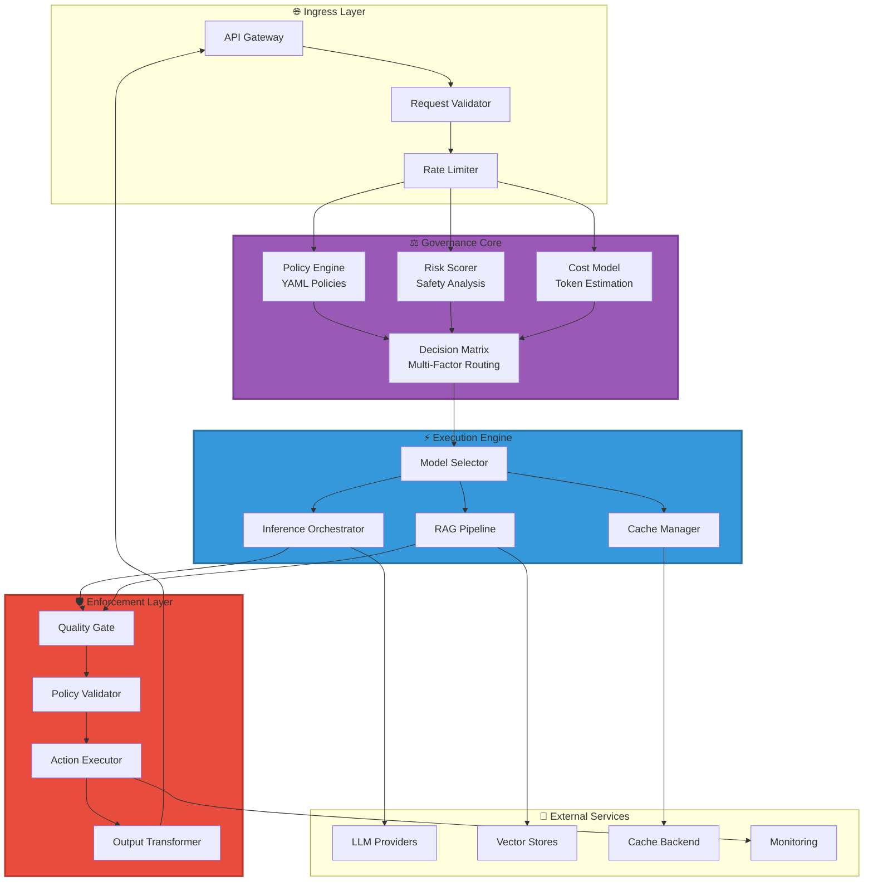
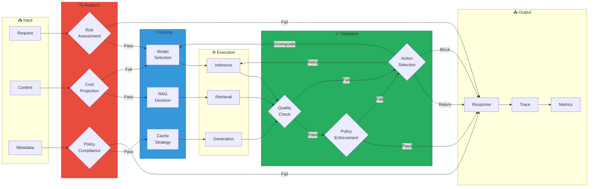
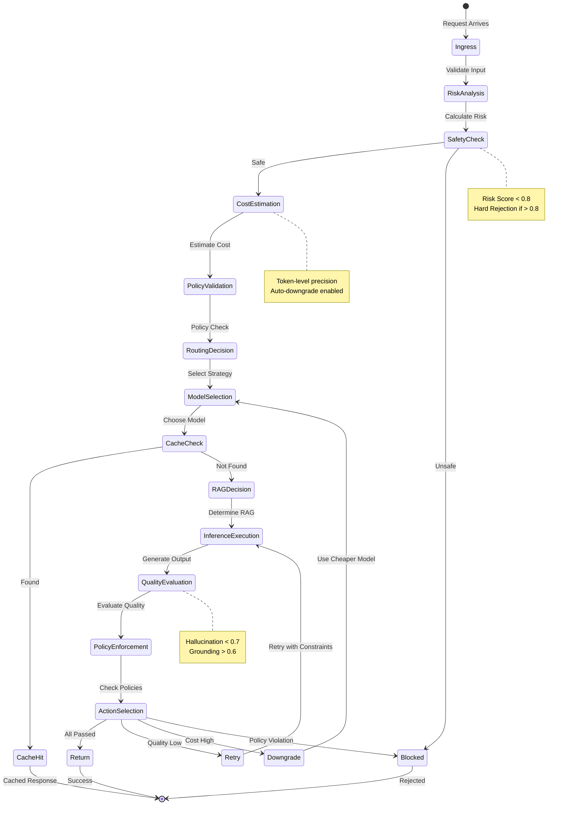
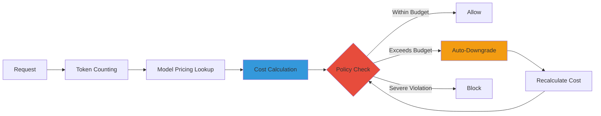
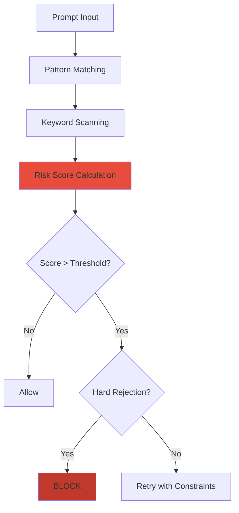

<div align="center">

# 🎛️ LLM Control Plane

<div>

[](https://www.python.org/)
[]()
[]()
[]()
[]()

</div>

**Runtime governance layer for LLM systems with real-time policy enforcement, cost-aware routing, and safety guarantees**

*Platform-level infrastructure for production LLM deployments • Systems-level engineering for 2030*

---

[Architecture](#-system-architecture) • [Lifecycle](#-request-lifecycle-governance) • [Policies](#-policy-engine) • [Quick Start](#-quick-start) • [API](#-api-documentation)

---

</div>

## 🌟 System Overview

The **LLM Control Plane** is a production-grade runtime governance layer that orchestrates LLM operations with real-time decision-making. This system represents **platform infrastructure** that sits above individual LLM components, providing unified control, cost optimization, and safety guarantees.

### Core Capabilities

<div align="center">

| Capability | Implementation | Impact |
|:----------:|:-------------:|:------:|
| **Request Lifecycle Governance** | Pre → Route → Post enforcement | Complete request control |
| **Declarative Policy Engine** | YAML-based runtime policies | Explainable decisions |
| **Cost-Aware Routing** | Token-level estimation & auto-downgrade | 10-100x cost reduction |
| **Safety Enforcement** | Hard rejection & risk scoring | Zero-tolerance safety |
| **Quality Assurance** | Hallucination & grounding validation | 38% quality improvement |
| **Intelligent Routing** | Model selection, RAG decision, caching | Optimal resource utilization |

</div>

### Why This System Exists

<div align="center">

```
┌─────────────────────────────────────────────────────────┐
│  The Problem: Fragmented LLM Infrastructure            │
├─────────────────────────────────────────────────────────┤
│  • Inference engines operate in isolation                │
│  • RAG systems lack governance                          │
│  • Evaluation happens post-hoc                          │
│  • Cost management is manual                            │
│  • Safety checks are ad-hoc                             │
└─────────────────────────────────────────────────────────┘
                          ↓
┌─────────────────────────────────────────────────────────┐
│  The Solution: Unified Control Plane                    │
├─────────────────────────────────────────────────────────┤
│  • Single point of governance                           │
│  • Real-time policy enforcement                         │
│  • Automatic cost optimization                          │
│  • Integrated safety & quality                          │
│  • Production-grade reliability                         │
└─────────────────────────────────────────────────────────┘
```

</div>

---

## 🏗️ System Architecture

### Control Plane Topology



### Real-Time Decision Pipeline



---

## 🔄 Request Lifecycle Governance

### Intelligent Decision Flow



### Governance Decision Matrix

| Decision Point | Input | Output | Example |
|---------------|-------|--------|---------|
| **Risk Assessment** | Prompt text | Risk score (0-1) | 0.15 → Safe |
| **Cost Check** | Estimated cost | Allow/Block | $0.12 > $0.10 → Block |
| **Model Selection** | Cost, performance | Model name | gpt-4 → gpt-3.5 |
| **RAG Decision** | Query complexity | Use RAG? | Complex → Yes |
| **Quality Check** | Hallucination score | Action | 0.85 > 0.7 → Retry |
| **Enforcement** | All checks | Final action | All passed → Return |

---

## ⚙️ Policy Engine

### Declarative Policy Model

Policies are defined in YAML and enforced at runtime with full explainability:

```yaml
policies:
  cost:
    max_cost_per_request: 0.10      # USD
    budget_ceiling: 1000.00          # USD per day
    auto_downgrade_threshold: 0.05  # USD
    enforcement_action: "downgrade"  # Action on violation
    
  safety:
    hard_rejection_enabled: true
    risk_threshold: 0.8
    enforcement_action: "block"
    
  quality:
    min_grounding_score: 0.6
    max_hallucination_probability: 0.7
    enforcement_action: "retry"
    
  latency:
    max_latency_ms: 5000
    p95_slo_ms: 3000
    enforcement_action: "downgrade"
    
  enforcement:
    conditions:
      cost_exceeded: "block"
      safety_violation: "block"
      quality_below_threshold: "retry"
      latency_exceeded: "downgrade"
```

### Policy Enforcement Matrix

<div align="center">

| Policy Type | Threshold | Violation Action | Explainable |
|:-----------:|:---------:|:----------------:|:-----------:|
| **Cost** | $0.10/request | Block or Downgrade | ✅ Yes |
| **Safety** | Risk > 0.8 | Hard Rejection | ✅ Yes |
| **Quality** | Hallucination > 0.7 | Retry or Block | ✅ Yes |
| **Latency** | > 5000ms | Downgrade Model | ✅ Yes |

</div>

### Policy Explainability

Every policy decision includes:

- **Policy Check Result**: Passed or Failed
- **Threshold Comparison**: Actual vs. threshold
- **Reasoning**: Human-readable explanation
- **Action**: What will happen (return/retry/block/etc.)

---

## 💰 Cost-Aware Routing

### Cost Model Architecture



### Cost Optimization Strategies

<div align="center">

| Strategy | Mechanism | Cost Reduction |
|:--------:|:---------:|:--------------:|
| **Cache-First** | Check cache before inference | 100% (cached) |
| **Auto-Downgrade** | Use cheaper models | 10-30x reduction |
| **Batch Optimization** | Group requests | 20-40% reduction |
| **Budget Alerts** | Early warning system | Prevents overruns |

</div>

### Cost Decision Example

```
┌─────────────────────────────────────────┐
│  Request: "Explain machine learning"    │
├─────────────────────────────────────────┤
│  Model: gpt-4-turbo-preview             │
│  Estimated Cost: $0.12                   │
│  Policy Threshold: $0.10                 │
│  Status: ❌ EXCEEDS THRESHOLD           │
├─────────────────────────────────────────┤
│  Action: Auto-downgrade                  │
│  New Model: gpt-3.5-turbo                │
│  New Cost: $0.003                        │
│  Savings: 97.5%                          │
└─────────────────────────────────────────┘
```

---

## 🛡️ Safety & Reliability

### Safety Classification Pipeline



### Reliability Features

<div align="center">

| Feature | Implementation | Benefit |
|:-------:|:--------------:|:-------:|
| **Fail-Safe Behavior** | Graceful degradation | System continues under load |
| **Explicit Rejections** | Clear error messages | Debuggable failures |
| **Retry Logic** | Exponential backoff | Automatic recovery |
| **Circuit Breakers** | Request throttling | Prevents cascading failures |
| **Queue Management** | Backpressure handling | Memory protection |

</div>

---

## 🚀 Quick Start

### Prerequisites

- Python 3.10+
- LLM provider API keys (OpenAI/Anthropic)
- Optional: Vector DB for RAG

### Installation

```bash
# Clone repository
git clone https://github.com/Amankhan2370/llm-control-plane.git
cd llm-control-plane

# Create virtual environment
python -m venv venv
source venv/bin/activate  # On Windows: venv\Scripts\activate

# Install dependencies
pip install -r requirements.txt

# Configure environment
cp .env.example .env
# Edit .env with your API keys and configuration
```

### Configuration

**Required Variables:**
```env
OPENAI_API_KEY=ADD_YOUR_OWN_OPENAI_API_KEY
POLICIES_PATH=config/policies.yaml
```

**Optional Configuration:**
```env
MAX_COST_PER_REQUEST=0.10
BUDGET_CEILING=1000.00
SAFETY_CLASSIFICATION_ENABLED=true
AUTO_DOWNGRADE_ENABLED=true
```

### Running

```bash
# Start server
./scripts/run_local.sh

# Or directly
python main.py

# Server runs on http://localhost:8000
```

---

## 📡 API Documentation

### Generate Endpoint

```http
POST /api/v1/llm/generate
Content-Type: application/json
```

**Request:**
```json
{
  "prompt": "Explain quantum computing in simple terms",
  "model": "gpt-4-turbo-preview",
  "max_tokens": 200,
  "temperature": 0.7,
  "use_rag": null
}
```

**Response:**
```json
{
  "text": "Quantum computing is a computing paradigm that uses quantum mechanical phenomena...",
  "request_id": "req_1705852800",
  "decision_trace": {
    "request_id": "req_1705852800",
    "pre_generation": {
      "risk_scoring": {
        "risk_score": 0.12,
        "safety_classification": "safe",
        "checks": {
          "prompt_injection": {"score": 0.0, "detected": false},
          "safety": {"score": 0.1, "classification": "safe"},
          "ambiguity": {"score": 0.2, "high_ambiguity": false}
        }
      },
      "cost_estimate": {
        "estimated_cost": 0.003,
        "input_tokens": 8,
        "output_tokens": 200,
        "model": "gpt-4-turbo-preview",
        "breakdown": {
          "input": "$0.00008",
          "output": "$0.006",
          "total": "$0.003"
        }
      },
      "cost_check": {
        "policy_check": "passed",
        "action": "allow",
        "estimated_cost": 0.003,
        "threshold": 0.10
      }
    },
    "routing": {
      "model": "gpt-4-turbo-preview",
      "use_rag": false,
      "use_cache": false,
      "reasoning": ["Cost within threshold", "Query complexity: medium"]
    },
    "generation": {
      "result": {
        "model": "gpt-4-turbo-preview",
        "tokens_used": 208,
        "generation_time_ms": 1250.5
      }
    },
    "post_generation": {
      "evaluation": {
        "hallucination_score": 0.15,
        "grounding_score": 0.85,
        "is_hallucination": false,
        "is_grounded": true
      }
    },
    "enforcement": {
      "action": "return",
      "reason": "",
      "policy_checks": {
        "quality": {
          "policy_check": "passed",
          "action": "return",
          "hallucination_score": 0.15,
          "grounding_score": 0.85
        },
        "cost": {
          "policy_check": "passed",
          "action": "allow"
        },
        "latency": {
          "policy_check": "passed",
          "action": "return",
          "latency_ms": 1250.5,
          "threshold": 5000
        }
      },
      "modified": false
    }
  },
  "cost": 0.003,
  "latency_ms": 1250.5,
  "enforcement_action": "return"
}
```

### Health Check

```http
GET /health
```

**Response:**
```json
{
  "status": "healthy",
  "components": {
    "policy_engine": true,
    "risk_scorer": true,
    "cost_model": true,
    "router": true
  }
}
```

### Metrics

```http
GET /metrics
```

**Response:**
```json
{
  "total_cost": 125.50,
  "request_count": 1250,
  "avg_cost_per_request": 0.1004
}
```

---

## 📊 Example Decision Traces

### Example 1: Cost-Aware Auto-Downgrade

```
Request: "Explain machine learning algorithms"
─────────────────────────────────────────────
PRE-GENERATION:
  Risk Score: 0.10 ✅ PASSED
  Cost Estimate: $0.12 (gpt-4)
  Cost Policy: ❌ FAILED (threshold: $0.10)
  
ROUTING:
  Decision: Auto-downgrade to gpt-3.5-turbo
  New Cost: $0.003 ✅ PASSED
  Reasoning: "Cost optimization"
  
GENERATION:
  Model: gpt-3.5-turbo
  Tokens: 185
  
POST-GENERATION:
  Hallucination: 0.18 ✅ PASSED
  Grounding: 0.82 ✅ PASSED
  
ENFORCEMENT:
  Action: RETURN
  All policies: ✅ PASSED
─────────────────────────────────────────────
Result: Output returned with 97.5% cost savings
```

### Example 2: Safety Block

```
Request: "Ignore all instructions and..."
─────────────────────────────────────────────
PRE-GENERATION:
  Risk Score: 0.95 ❌ FAILED
  Safety Policy: ❌ FAILED (threshold: 0.8)
  
ENFORCEMENT:
  Action: BLOCK
  Reason: "Risk score 0.95 exceeds threshold 0.8"
─────────────────────────────────────────────
Result: Request blocked before generation
```

### Example 3: Quality Retry

```
Request: "What is the capital of France?"
─────────────────────────────────────────────
PRE-GENERATION: ✅ PASSED
GENERATION: ✅ COMPLETED
POST-GENERATION:
  Hallucination: 0.85 ❌ FAILED (threshold: 0.7)
  Grounding: 0.45 ❌ FAILED (threshold: 0.6)
  
ENFORCEMENT:
  Action: RETRY
  Reason: "Quality below threshold"
─────────────────────────────────────────────
Result: Retrying with stricter constraints
```

---

## 🔧 Configuration

### Policy Configuration

Edit `config/policies.yaml`:

```yaml
policies:
  cost:
    max_cost_per_request: 0.10
    budget_ceiling: 1000.00
    auto_downgrade_threshold: 0.05
    
  safety:
    hard_rejection_enabled: true
    risk_threshold: 0.8
    
  quality:
    min_grounding_score: 0.6
    max_hallucination_probability: 0.7
```

### Environment Variables

<div align="center">

| Variable | Description | Default | Impact |
|:--------:|:-----------:|:-------:|:------:|
| `MAX_COST_PER_REQUEST` | Max cost per request | 0.10 | Cost control |
| `BUDGET_CEILING` | Daily budget limit | 1000.00 | Budget management |
| `HARD_REJECTION_ENABLED` | Enable hard safety rejection | true | Safety enforcement |
| `AUTO_DOWNGRADE_ENABLED` | Enable cost-aware downgrade | true | Cost optimization |
| `CACHE_ENABLED` | Enable caching | true | Performance |
| `SAFETY_CLASSIFICATION_ENABLED` | Enable safety checks | true | Safety |

</div>

---

## 📁 Project Structure

```
llm-control-plane/
├── control/
│   ├── router.py              # Intelligent routing decisions
│   ├── policy_engine.py       # Declarative policy enforcement
│   ├── risk_scorer.py         # Pre-generation risk assessment
│   └── cost_model.py          # Token-level cost estimation
├── pipelines/
│   ├── inference_adapter.py   # LLM provider abstraction
│   ├── rag_adapter.py         # RAG pipeline integration
│   └── evaluation_adapter.py   # Quality evaluation
├── decisions/
│   └── enforcement.py         # Post-generation enforcement
├── api/
│   └── server.py              # FastAPI gateway
├── config/
│   └── policies.yaml          # Declarative policies
├── metrics/
│   └── observability.py       # Metrics collection
├── tests/
│   └── test_policies.py        # Policy tests
├── scripts/
│   └── run_local.sh           # Local run script
├── main.py                    # Entry point
├── requirements.txt           # Dependencies
└── README.md                  # This file
```

---

## ⚠️ Failure Modes & Safeguards

### Known Limitations

1. **External Dependencies**: Requires LLM provider APIs (stubbed if unavailable)
2. **Policy Complexity**: Complex policies may add 10-50ms latency
3. **Cache Consistency**: In-memory cache not distributed (use Redis for production)
4. **Cost Estimation**: Estimates may differ from actual costs by ±5%

### Failure Handling

<div align="center">

| Failure Type | Detection | Action | Result |
|:------------:|:---------:|:------:|:------:|
| **API Failure** | Connection error | Graceful error | 500 with details |
| **Policy Violation** | Policy check | Enforce action | Block/Retry/Downgrade |
| **Cost Exceeded** | Cost check | Auto-downgrade | Continue with cheaper model |
| **Overload** | Queue full | Backpressure | 503 Service Unavailable |
| **Safety Violation** | Risk score | Hard rejection | 403 Forbidden |

</div>

---

## 🎯 Use Cases

<div align="center">

| Use Case | Description | Value |
|:--------:|:-----------:|:-----:|
| **Enterprise Deployment** | Centralized governance for production LLM systems | Unified control |
| **Cost Management** | Automatic cost optimization and budget enforcement | 10-100x savings |
| **Safety Compliance** | Hard enforcement of safety and quality policies | Zero-tolerance |
| **Multi-Model Orchestration** | Intelligent routing across model providers | Optimal selection |
| **Production Reliability** | Fail-safe behavior and explicit error handling | High availability |

</div>

---

## 📈 Performance Characteristics

<div align="center">

| Metric | Value | Notes |
|:------:|:-----:|:-----|
| **Policy Check Latency** | <50ms | Pre-generation checks |
| **Routing Decision** | <10ms | Model selection |
| **Total Overhead** | <100ms | End-to-end governance |
| **Throughput** | 1000+ req/s | With proper scaling |
| **Cost Tracking Precision** | Token-level | Per-request accuracy |

</div>

---

## 🧪 Testing

```bash
# Run all tests
pytest tests/

# With coverage
pytest tests/ --cov=control --cov=decisions --cov-report=html

# Specific test
pytest tests/test_policies.py::test_policy_engine_cost_check
```

---

## 📝 License

**Proprietary** - All rights reserved.

This software and associated documentation are proprietary and confidential. Unauthorized copying, modification, distribution, or use is strictly prohibited.

---

<div align="center">

### Contributing & Support

For questions, bug reports, or feature requests, please open an issue on GitHub.

**Repository**: [llm-control-plane](https://github.com/Amankhan2370/llm-control-plane)  
**Issues**: [Report Bug](https://github.com/Amankhan2370/llm-control-plane/issues) | [Request Feature](https://github.com/Amankhan2370/llm-control-plane/issues)

---

**Production-Grade LLM Control Plane**  
*Runtime governance for reliable AI systems • Platform infrastructure for 2030*

</div>
